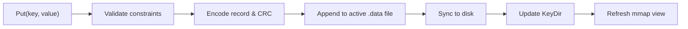
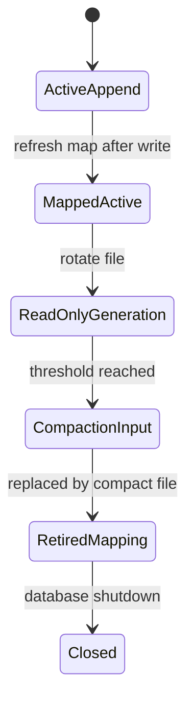

# Zero-Copy Bitcask Storage Engine

Welcome to the Zero-Copy Bitcask Storage Engine! This is a high-performance, append-only key-value store optimized for exceptionally fast point reads.

Instead of copying data into newly allocated buffers, our engine reads values directly from memory-mapped log files. When you perform a `Get` operation, you receive a byte slice backed directly by `mmap`. This means zero allocations on the read path and blazing fast performance.

## How it works

The engine follows the Bitcask design pattern but pushes it further with memory mapping. We write all data sequentially to an active segment file and keep an in-memory index, called the KeyDir, that maps keys to their exact file offsets. 

### Data Flow



When you read a key, we look up the coordinates in the KeyDir and slice the exact memory-mapped region.


## Core Features

* **Zero-copy reads:** The `Get` method returns a direct pointer into mapped file memory.
* **Crash resilient:** We use strict CRC32 checksums and robust recovery mechanisms to handle partial or torn writes.
* **Sharded KeyDir:** The in-memory map is sharded to minimize lock contention during highly concurrent workloads.
* **Lock-free point reads:** Readers do not block writers. 
* **Background Compaction:** We gracefully compact older segments in the background, removing overwritten data and tombstones to reclaim disk space.

## Architecture Highlights

Our active data segment is strictly append-only. Once it reaches a specific threshold, it rotates into a read-only state and a new active segment is created. 



### Storage Format

Every record appended to disk has a lightweight, predictable layout:
```text
| CRC32 (4 Bytes) | Timestamp (8 Bytes) | KeySize (4 Bytes) | ValueSize (4 Bytes) | Key | Value |
```
The CRC checksum protects the entire payload. We use a zero `ValueSize` to mark deleted keys (tombstones).

## Getting Started

Dive into the code, check out the benchmarks in the `docs` folder, and feel free to open issues or pull requests. Enjoy building with a storage engine that respects your memory allocator!
