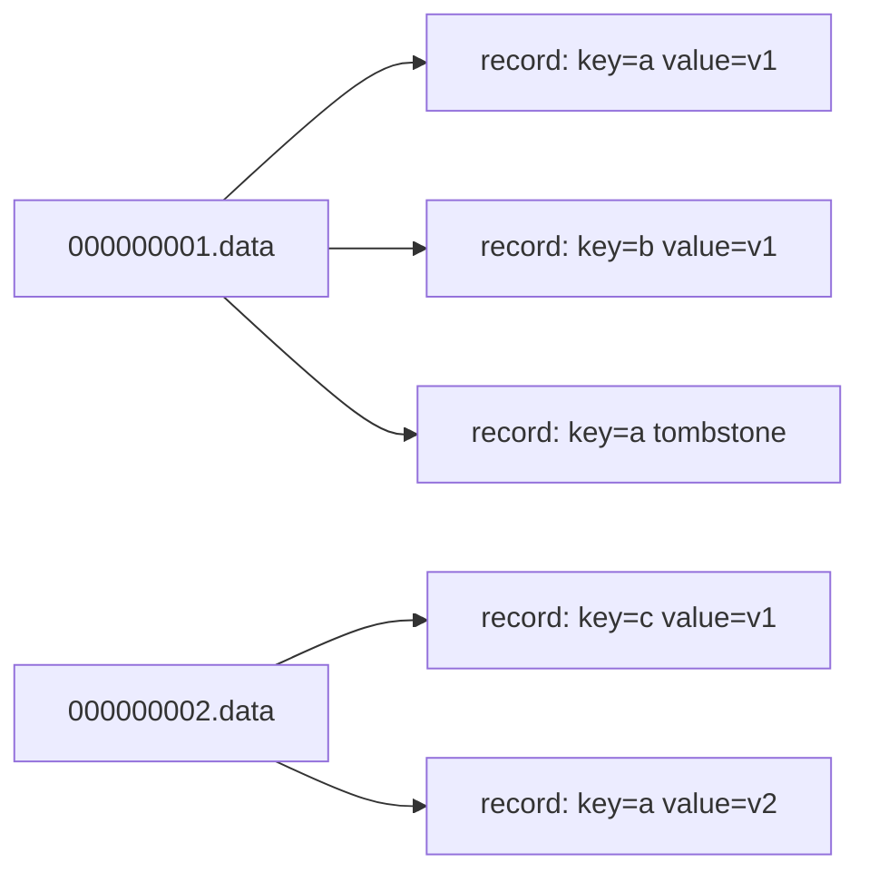
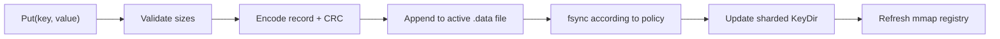
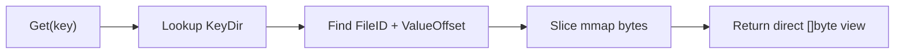
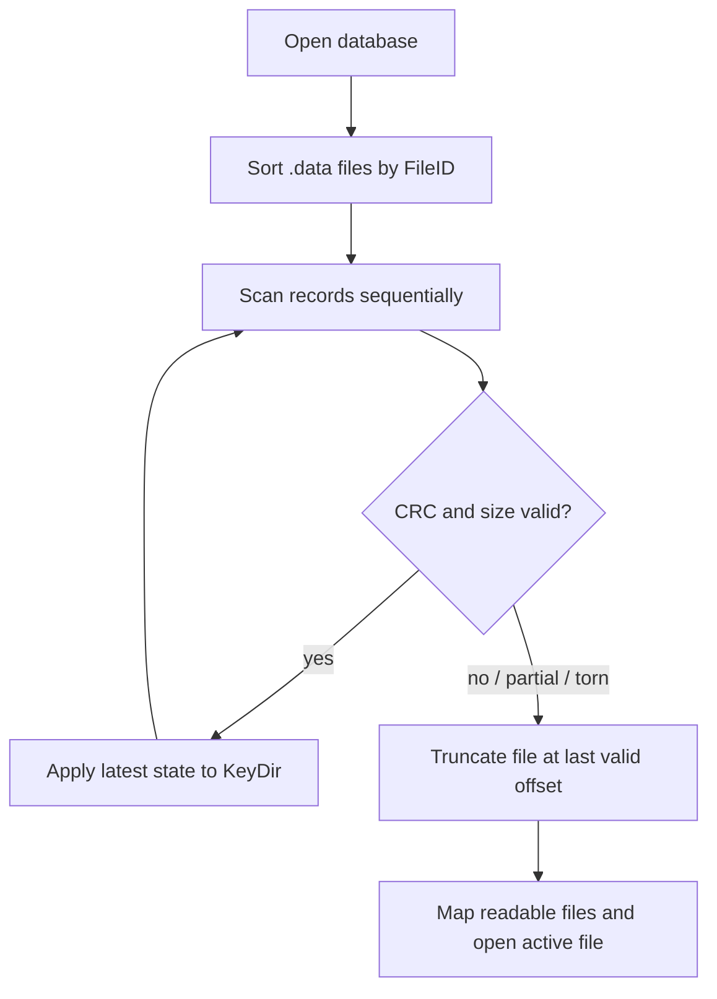
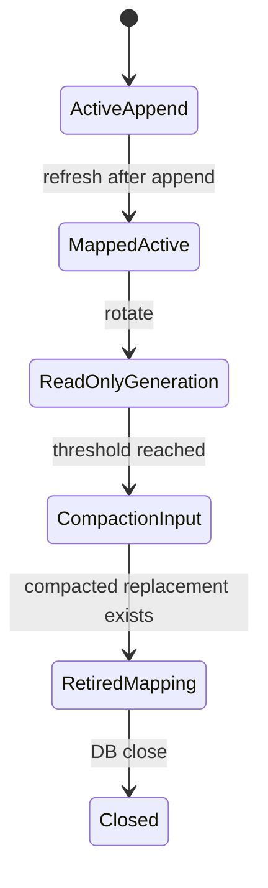
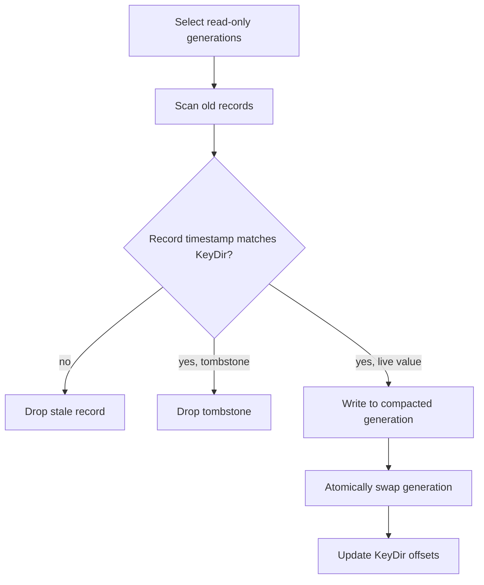
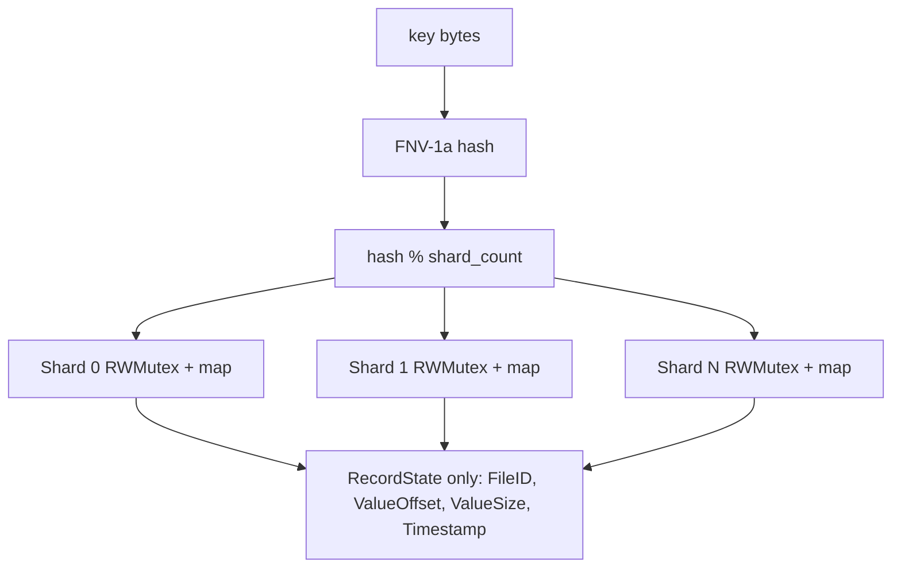

# Zero-Copy Bitcask Storage Engine

This project is an append-only key-value store optimized for point reads. Values are read directly from memory-mapped log files; `Get` returns a slice backed by mmap rather than allocating and copying a value buffer.

## Storage Format

Every record is:

```text
| CRC32 4B | Timestamp 8B | KeySize 4B | ValueSize 4B | Key | Value |
```

The CRC covers `Timestamp + KeySize + ValueSize + Key + Value`. A `ValueSize` of `0` is a tombstone.

## Segment Structure



Segments are immutable after rotation. The active segment is append-only. Compaction writes a fresh generation containing only live records and then opens a newer active segment.

## Write Path



Fsync policies:

- `FsyncEveryWrite`: acknowledge only after the active file reaches stable storage.
- `FsyncInterval`: group fsyncs by time interval.
- `FsyncManual`: caller is responsible for `Sync`.

## Read Path



The returned value must be treated as read-only. It points into mapped file memory.

## Recovery Path



Recovery handles:

- Partial writes: short headers or payloads are truncated.
- Torn writes: invalid size fields or CRC mismatches are truncated.
- Tombstones: delete markers rebuild as missing keys.

## Mmap Lifecycle

The active file is append-only. After writes, the file is remapped so new values are visible through `Get`. Older mappings are retired and closed on database shutdown, which avoids invalidating slices already returned to callers.



## Compaction



Compaction removes overwritten records and tombstones from read-only files. A background worker can call `RunCompaction`.

## Shard Distribution



The KeyDir never stores values. It stores only disk coordinates, keeping RAM proportional to key count rather than value size.

## Observability

`DB.Stats()` exposes counters for reads, writes, deletes, fsyncs, rotations, compactions, mmap refreshes, corrupt records observed during recovery, tombstones, live key count, and retired mmap regions.

## Benchmarks

Current benchmark coverage includes:

- Random zero-copy point reads.
- Manual-fsync write throughput.
- Every-write-fsync throughput.
- p99-style read latency reporting.
- mmap slicing vs `os.File.ReadAt`.

External engine comparisons such as BadgerDB, Pebble, and RocksDB should live behind build tags so the core module remains dependency-light.
